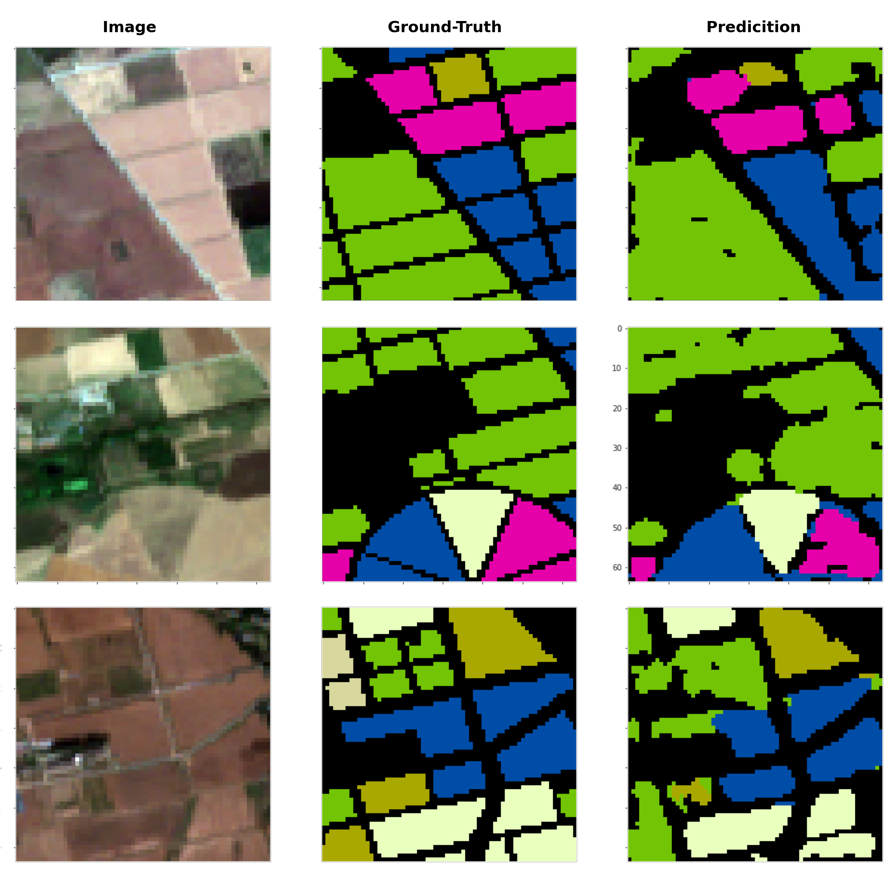
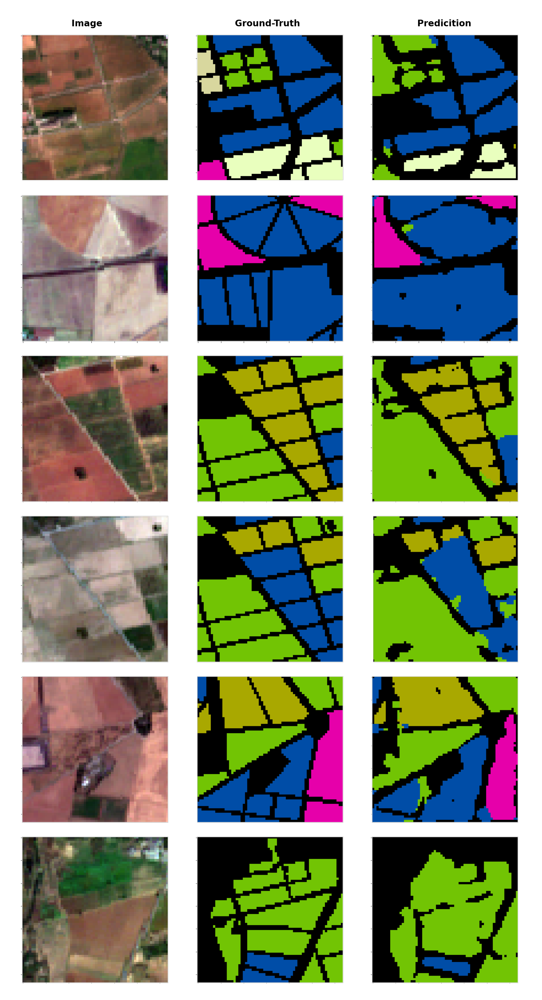
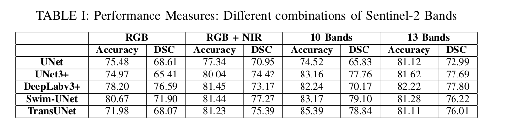
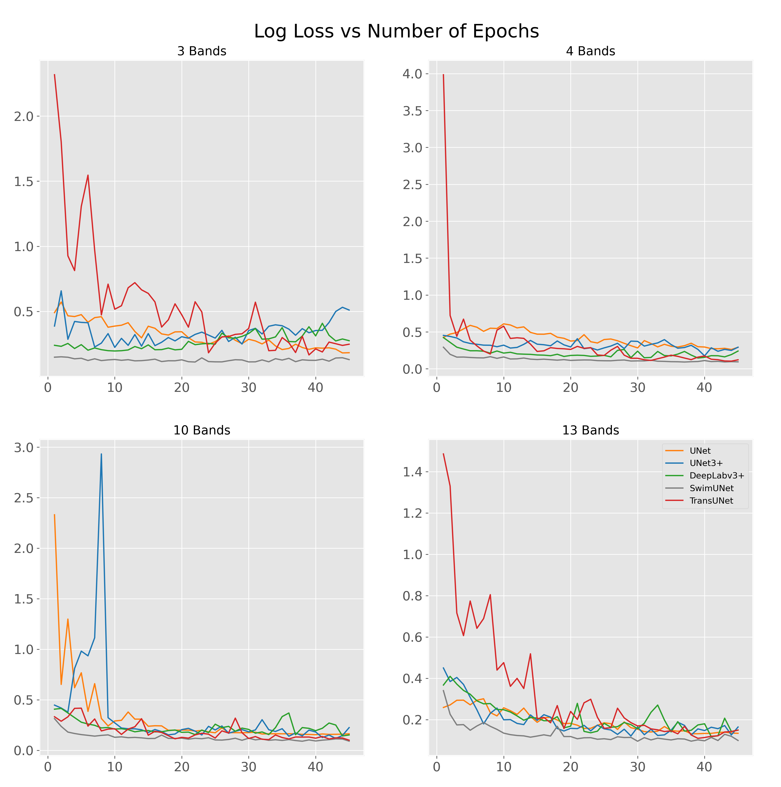

# Crop Type Classification
This Repository contains code and trained models (will be published after paper acceptance) and benchmark results for the paper:
```
Crop Type Classification using Multi-temporal Sentinel-2 Satellite Imagery: A Deep Semantic Segmentation Approach
```

<br>
Submitted at: 5th International Conference on Robotics and Automation in Industry (ICRAI)

# Segmentation Models
1. UNet
2. UNet3+
3. DeepLabv3+
4. Swim-UNet
5. TransUNet

# Pre-requistes
Main packages required are:
 - RensorFlow v2.9.2
 - Keras v2.9.0
 - rasterio
 - numpy
 - matplotlib
 - albumentations

# Datasets
We used Google Earth Engine to generate the Dataset collected from National Agriculture Research Center, Islamabad. Crop categories includes:
1. Fodder
2. Oilseeds
3. Pulses
4. Wheat
5. MSM (Millet, Sorghum, Maize)
6. Others

# Visual Results
Some Visual results are following:




# Quantitative Results


# Performance Graphs
Loss: Different models and different band combinations




# Maintainer 
Asim Hameed Khan (asimhameed.cs@gmail.com)


